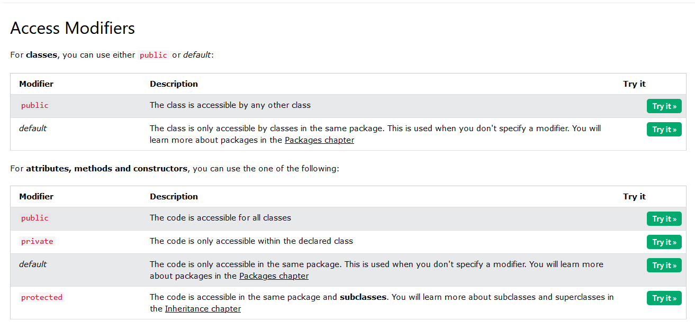
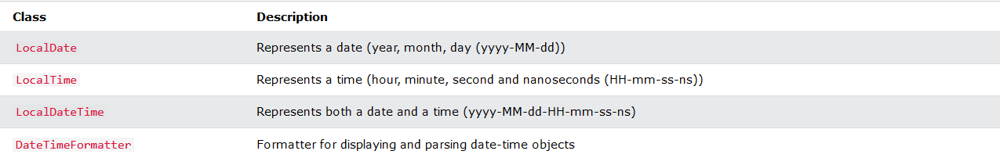
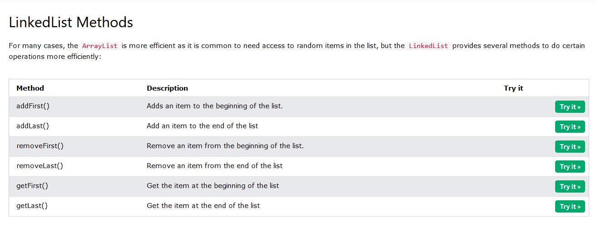

#Java - What is OOP?
OOP stands for Object-Oriented Programming.

Procedural programming is about writing procedures or methods that perform operations on the data, while object-oriented programming is about creating objects that contain both data and methods.

Object-oriented programming has several advantages over procedural programming:

    OOP is faster and easier to execute
    OOP provides a clear structure for the programs
    OOP helps to keep the Java code DRY "Don't Repeat Yourself", and makes the code easier to maintain, modify and debug
    OOP makes it possible to create full reusable applications with less code and shorter development time

Tip: The "Don't Repeat Yourself" (DRY) principle is about reducing the repetition of code. You should extract out the codes that are common for the application, and place them at a single place and reuse them instead of repeating it.

Classes and objects are the two main aspects of object-oriented programming.

**So, a class is a template for objects, and an object is an instance of a class.**

###### Java is an object-oriented programming language.

Everything in Java is associated with classes and objects, along with its attributes and methods. For example: in real life, a car is an object. The car has attributes, such as weight and color, and methods, such as drive and brake.

A Class is like an object constructor, or a "blueprint" for creating objects.

#####Static vs. Public

You will often see Java programs that have either static or public attributes and methods.

**In the example above, we created a static method, which means that it can be accessed without creating an object of the class, unlike public, which can only be accessed by objects:**

###Remember that..

The dot (.) is used to access the object's attributes and methods.

To call a method in Java, write the method name followed by a set of parentheses (), followed by a semicolon (;).

A class must have a matching filename (Main and Main.java).

#### Java Constructors

A constructor in Java is a special method that is used to initialize objects. The constructor is called when an object of a class is created. It can be used to set initial values for object attributes:

-- Note that the constructor name must match the class name, and it cannot have a return type (like void).

-- Also note that the constructor is called when the object is created.

-- All classes have constructors by default: if you do not create a class constructor yourself, Java creates one for you. However, then you are not able to set initial values for object attributes.

####Modifiers
The public keyword is an access modifier, meaning that it is used to set the access level for classes, attributes, methods and constructors.

We divide modifiers into two groups:

    Access Modifiers - controls the access level
    Non-Access Modifiers - do not control access level, but provides other functionality
    
 
 
 
####Java Encapsulation

The meaning of Encapsulation, is to make sure that "sensitive" data is hidden from users. To achieve this, you must:

    declare class variables/attributes as private
    provide public get and set methods to access and update the value of a private variable

###### Get and Set

You learned from the previous chapter that private variables can only be accessed within the same class (an outside class has no access to it). However, it is possible to access them if we provide public get and set methods.

The get method returns the variable value, and the set method sets the value.

Syntax for both is that they start with either get or set, followed by the name of the variable, with the first letter in upper case:

**Example**

public class Person {  
  private String name; // private = restricted access  

  // Getter  
  public String getName() {  
    return name;  
  }  
  
  // Setter  
  public void setName(String newName) {  
    this.name = newName;  
  }  
}  

**Example explained**

The **get method** returns the value of the variable name.

The **set method** takes a parameter (newName) and assigns it to the name variable. The **this** keyword is used to refer to the current object.

However, as the name variable is declared as private, we cannot access it from outside this class:  

**Why Encapsulation?**
- Better control of class attributes and methods
- Class attributes can be made read-only (if you only use the get method), or write-only (if you only use the set method)
- Flexible: the programmer can change one part of the code without affecting other parts
- Increased security of data

### Java Inheritance (Subclass and Superclass)

In Java, it is possible to inherit attributes and methods from one class to another. We group the "inheritance concept" into two categories:

    subclass (child) - the class that inherits from another class
    superclass (parent) - the class being inherited from

To inherit from a class, use the **extends** keyword.

In the example below, the Car class (subclass) inherits the attributes and methods from the Vehicle class (superclass):

We set the brand attribute in Vehicle to a protected access modifier. If it was set to **private**, the Car class would not be able to access it.

###Java Polymorphism
Polymorphism means "many forms", and it occurs when we have many classes that are related to each other by inheritance.

Like we specified in the previous chapter; Inheritance lets us inherit attributes and methods from another class. Polymorphism uses those methods to perform different tasks. This allows us to perform a single action in different ways.

For example, think of a superclass called Animal that has a method called animalSound(). Subclasses of Animals could be Pigs, Cats, Dogs, Birds - And they also have their own implementation of an animal sound (the pig oinks, and the cat meows, etc.):

##### Why And When To Use "Inheritance" and "Polymorphism"?

- It is useful for code reusability: reuse attributes and methods of an existing class when you create a new class.

### Java Inner Classes
In Java, it is also possible to nest classes (a class within a class). The purpose of nested classes is to group classes that belong together, which makes your code more readable and maintainable.

To access the inner class, create an object of the outer class, and then create an object of the inner class:

### Abstract Classes and Methods
Data abstraction is the process of hiding certain details and showing only essential information to the user.  
Abstraction can be achieved with either abstract classes or interfaces (which you will learn more about in the next chapter).

The abstract keyword is a non-access modifier, used for classes and methods:

    Abstract class: is a restricted class that cannot be used to create objects (to access it, it must be inherited from another class).

    Abstract method: can only be used in an abstract class, and it does not have a body. The body is provided by the subclass (inherited from).
    
To access the abstract class, it must be inherited from another class. Let's convert the Animal class we used in the Polymorphism chapter to an abstract class:

**Why And When To Use Abstract Classes and Methods?**

To achieve security - hide certain details and only show the important details of an object.

Note: Abstraction can also be achieved with Interfaces, which you will learn more about in the next chapter.

###Interfaces

Another way to achieve abstraction in Java, is with interfaces.

An interface is a completely "abstract class" that is used to group related methods with empty bodies:

**Notes on Interfaces:**

    Like abstract classes, interfaces cannot be used to create objects (in the example above, it is not possible to create an "Animal" object in the MyMainClass)
    Interface methods do not have a body - the body is provided by the "implement" class
    On implementation of an interface, you must override all of its methods
    Interface methods are by default abstract and public
    Interface attributes are by default public, static and final
    An interface cannot contain a constructor (as it cannot be used to create objects)

**Why And When To Use Interfaces?**

1) To achieve security - hide certain details and only show the important details of an object (interface).

2) Java does not support "multiple inheritance" (a class can only inherit from one superclass). However, it can be achieved with interfaces, because the class can implement multiple interfaces. Note: To implement multiple interfaces, separate them with a comma (see example below).

#### Java Date and Time
Java does not have a built-in Date class, but we can import the java.time package to work with the date and time API. The package includes many date and time classes. For example:
 

**Display Current Time**

To display the current time (hour, minute, second, and nanoseconds), import the java.time.LocalTime class, and use its now() method:

### Java ArrayList

The ArrayList class is a resizable array, which can be found in the java.util package.

The difference between a built-in array and an ArrayList in Java, is that the size of an array cannot be modified (if you want to add or remove elements to/from an array, you have to create a new one). While elements can be added and removed from an ArrayList whenever you want. The syntax is also slightly different:

**Example**

Create an ArrayList object called cars that will store strings:

import java.util.ArrayList; // import the ArrayList class

ArrayList<String> cars = new ArrayList<String>(); // Create an ArrayList object

### Java LinkedList

In the previous chapter, you learned about the ArrayList class. The LinkedList class is almost identical to the ArrayList:

**When To Use**

Use an ArrayList for storing and accessing data, and LinkedList to manipulate data.
 
 
#### Java HashMap
 
A HashMap however, store items in **"key/value"** pairs, and you can access them by an index of another type (e.g. a String).

One object is used as a key (index) to another object (value). It can store different types: String keys and Integer values, or the same type, like: String keys and String values:

**Example**

Create a HashMap object called capitalCities that will store **String keys** and **String values**:

### Java HashSet
A HashSet is a collection of items where every item is unique, and it is found in the java.util package:

### Java Iterator
An Iterator is an object that can be used to loop through collections, like ArrayList and HashSet. It is called an "iterator" because "iterating" is the technical term for looping.  
To use an Iterator, you must import it from the java.util package.

### Java Exceptions
When executing Java code, different errors can occur: coding errors made by the programmer, errors due to wrong input, or other unforeseeable things.  
When an error occurs, Java will normally stop and generate an error message. The technical term for this is: Java will throw an exception (throw an error).

**Java try and catch**

The try statement allows you to define a block of code to be tested for errors while it is being executed.

The catch statement allows you to define a block of code to be executed, if an error occurs in the try block.

The try and catch keywords come in pairs: