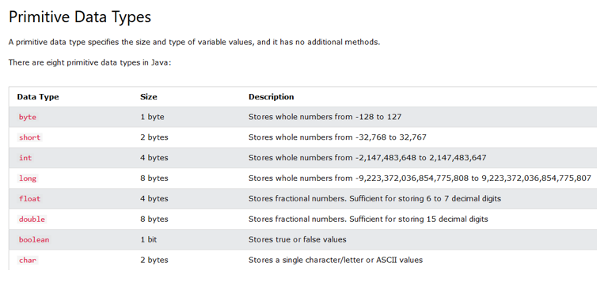
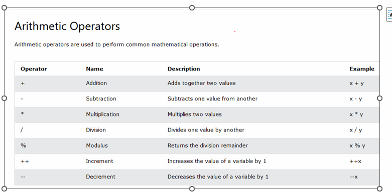
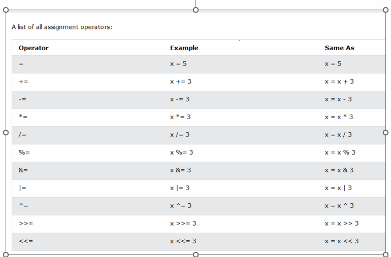
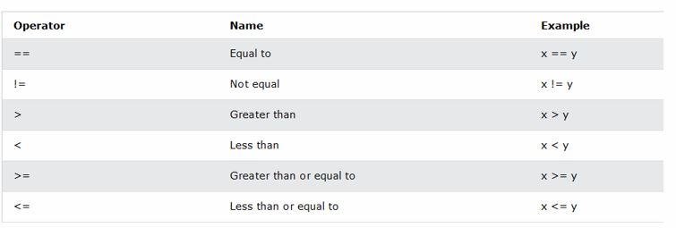
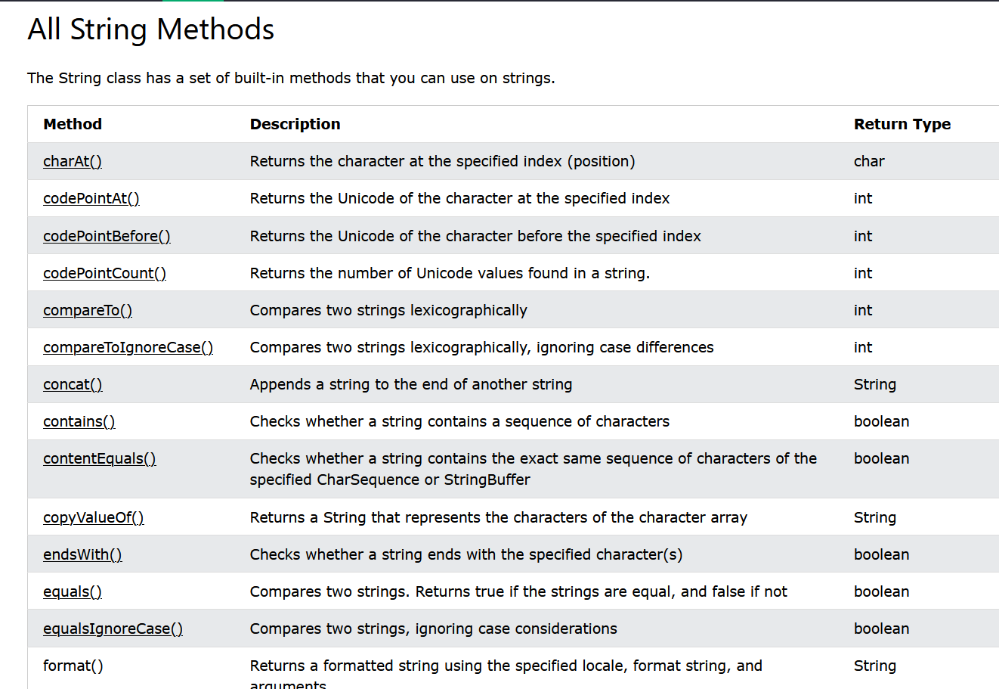
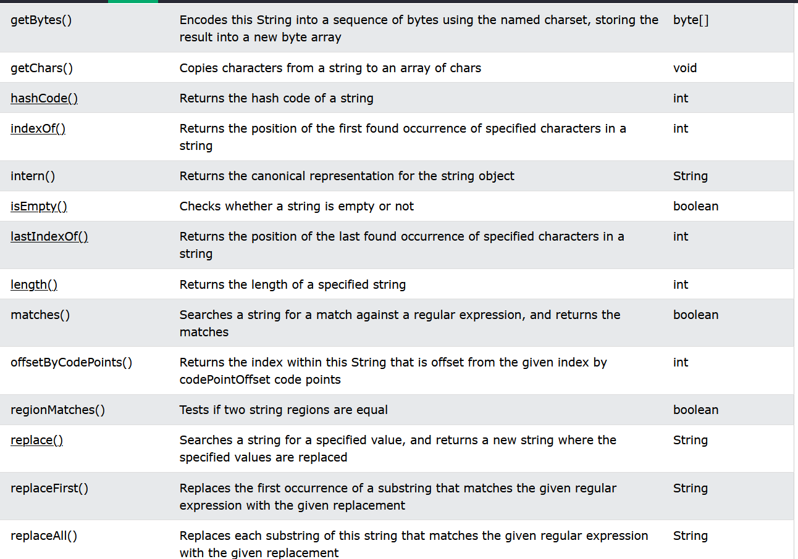
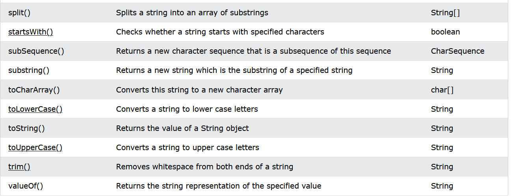
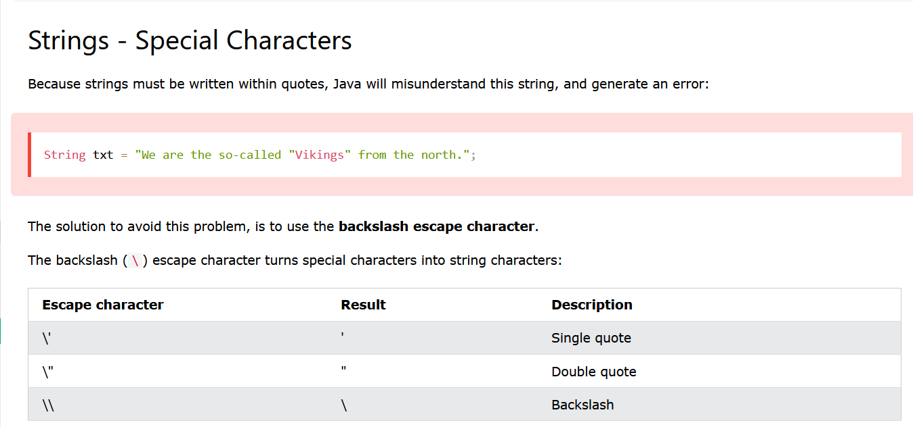
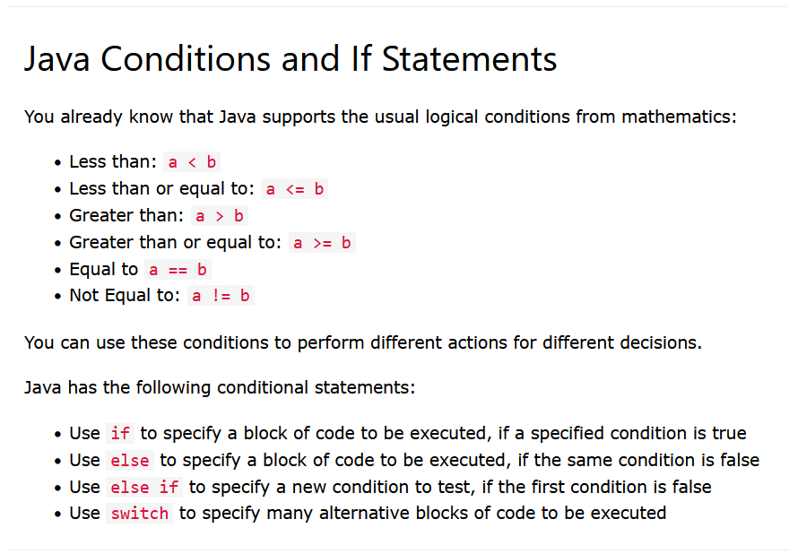

# Definition
The general rules for naming variables are:

    Names can contain letters, digits, underscores, and dollar signs
    Names must begin with a letter
    Names should start with a lowercase letter and it cannot contain whitespace
    Names can also begin with $ and _ (but we will not use it in this tutorial)
    Names are case sensitive ("myVar" and "myvar" are different variables)
    Reserved words (like Java keywords, such as int or boolean) cannot be used as names


Variables are containers for storing data values.

1.	String - stores text, such as "Hello". String values are surrounded by double quotes
2.	int - stores integers (whole numbers), without decimals, such as 123 or -123
3.	float - stores floating point numbers, with decimals, such as 19.99 or -19.99
4.	char - stores single characters, such as 'a' or 'B'. Char values are surrounded by single quotes
5.	boolean - stores values with two states: true or false

# Declaring (Creating) Variables
```
type variableName = value;
```

`Anupama`

# Data types are divided into two groups:

- Primitive data types - includes byte, short, int, long, float, double, boolean and char

- Non-primitive data types - such as String, Arrays and Classes


# Primitive Data Types
#### Second header


* Hello
* Hello

### Number and Float types

Numbers: Primitive number types are divided into two groups:
1.	Integer types stores whole numbers, positive or negative (such as 123 or -456), without decimals. Valid types are byte, short, int and long. Which type you should use, depends on the numeric value.
2.	Floating point types represents numbers with a fractional part, containing one or more decimals. There are two types: float and double.
Long -- should end the value with an "L" 
The float and double data types  should end the value with an "f" for floats and "d" for doubles:

#### Java math
Math.max(x,y)  
Math.min(x,y)  
Math.sqrt(x)  
Math.abs(x) method returns the absolute (positive) value of x:  
Math.random() returns a random number between 0.0 (inclusive), and 1.0 (exclusive):  
int randomNum = (int)(Math.random() * 101);  //  if you only want a random number between 0 and 100,  

### Boolean Types
Very often in programming, you will need a data type that can only have one of two values, like:  

YES / NO  
ON / OFF  
TRUE / FALSE
    
    

# Arithmatic Operators




#Java Strings
Strings are used for storing text.

- A String variable contains a collection of characters surrounded by double quotes:

###String Length

- A String in Java is actually an object, which contain methods that can perform certain operations on strings. For example, the length of a string can be found with the length() method:

###String Uses
- length()
- toUpperCase() 
- toLowerCase()
- indexOf(): Finding a Character in a String


###String Methods





### Strings Special Characters




Other common escape sequences that are valid in Java are:
* \n  new line
* \r Carriage return
* \t tab
* \b backspace
* \f Form Feed

#If Else Condition

